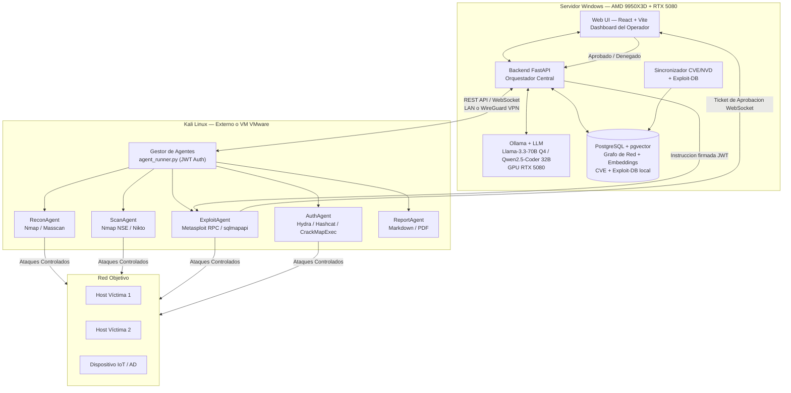

# Plan de Implementación: ForceVector — Framework de Pentesting con IA

**Versión:** 2.0 — Arquitectura Distribuida (Windows Server + Kali Linux)

Este documento describe el diseño de software del framework multiagente **ForceVector** adaptado a una arquitectura distribuida en dos nodos, aprovechando el hardware de alta gama disponible para maximizar el rendimiento del LLM y las capacidades ofensivas del sistema.

---

## Hardware de Referencia

| Componente | Especificación |
|---|---|
| **CPU** | AMD Ryzen 9 9950X3D (16 cores / 32 threads, 3D V-Cache 128 MB) |
| **RAM** | 64 GB DDR5 |
| **GPU** | NVIDIA GeForce RTX 5080 (16 GB VRAM) |
| **Almacenamiento** | 4 TB NVMe SSD |
| **SO Servidor** | Windows 11 / Windows Server |
| **SO Atacante** | Kali Linux (externo o VM) |

> La GPU RTX 5080 con 16 GB de VRAM es suficiente para ejecutar modelos LLM de hasta **70B cuantizados (Q4)** o modelos de 32B a plena precisión con Ollama. El 3D V-Cache del 9950X3D aporta latencia extremadamente baja para las operaciones de búsqueda vectorial en PostgreSQL.

---

## 1. Arquitectura General del Sistema

La arquitectura se divide en **dos nodos** que se comunican por red local o VPN:

### Nodo 1 — Servidor Windows (Cerebro del Sistema)
- Ejecuta **Ollama** con el LLM local, acelerado por la **RTX 5080**.
- Aloja **PostgreSQL 18 + pgvector** como base de datos de memoria semántica y grafo de red.
- Expone una **API REST/WebSocket** (FastAPI) a los agentes de Kali.
- Mantiene sincronización local con **CVE NVD** y **Exploit-DB**.
- Sirve la **interfaz web** (React) al operador.

### Nodo 2 — Kali Linux (Brazo Ejecutor)
- Ejecuta los **agentes tácticos** (Nmap, Metasploit, Sqlmap, Hydra, etc.).
- Envía resultados parseados al servidor Windows vía API.
- Recibe órdenes del orquestador (LLM) desde el servidor Windows.
- Puede ser una **máquina física externa** o una **VM en VMware Workstation Pro** sobre el mismo equipo.



---

## 2. Diseño de Red y Conectividad

### Opción A — Kali como VM en VMware Workstation Pro (Recomendada para laboratorio)

```
┌─────────────────────────────────────────────────────────────┐
│  Host Windows (AMD 9950X3D + RTX 5080)                      │
│                                                              │
│  ┌─────────────────────┐    ┌──────────────────────────────┐│
│  │  Servidor ForceVector│    │  VM Kali Linux (VMware)     ││
│  │  · Ollama :11434     │    │  · Agentes tácticos          ││
│  │  · FastAPI :8000     │◄──►│  · Metasploit / Nmap         ││
│  │  · PostgreSQL :5432  │    │  · Conexión a API :8000      ││
│  │  · React UI :3000    │    │                              ││
│  └─────────────────────┘    └──────────────────────────────┘│
│                     Red VMnet (VMware Virtual Network)              │
└─────────────────────────────────────────────────────────────┘
         │
         │ Switch físico / Red de laboratorio
         ▼
   [Red Objetivo — Hosts víctima VMs]
```

### Opción B — Kali como Máquina Física Externa

```
[Windows Server]  ←── LAN / WireGuard VPN ──►  [Kali Linux Físico]
  API :8000                                       Agentes tácticos
  Ollama :11434                                   → Red Objetivo
  PostgreSQL :5432
```

> **Seguridad Inter-nodo (Zero Trust interno):** La comunicación entre nodos se autentica estrictamente mediante **tokens JWT** firmados (HS256). El secreto `AGENT_JWT_SECRET` se genera criptográficamente (mínimo 32 bytes) en el servidor y se configura de forma segura en el agente Kali. Si se usa Kali externo, se recomienda un túnel **WireGuard** para cifrar el tráfico de red.

---

## 3. Pila Tecnológica

### 3.1 Servidor Windows

| Capa | Tecnología | Justificación |
|---|---|---|
| **LLM Runtime** | Ollama 0.5+ (CUDA) | Soporte nativo para RTX 5080 (arquitectura Blackwell) |
| **Modelo LLM** | `llama3.3:70b-instruct-q4_K_M` | 70B Q4 ≈ 40 GB VRAM+RAM; máximo razonamiento |
| **Modelo alternativo** | `qwen2.5-coder:32b-q8` | 32B Q8 para iteraciones de desarrollo ágiles |
| **Modelo Embeddings** | `nomic-embed-text:v1.5` | Rápido, 768 dims, ideal para pgvector |
| **API Backend** | Python 3.12 + FastAPI + Uvicorn | Async nativo, WebSockets, OpenAPI automático |
| **Base de Datos** | PostgreSQL 18 + pgvector 0.7+ | Búsqueda vectorial ANN + relacional en un motor |
| **Cache/Queue** | Redis 7 | Cola de tareas para agentes + caché de resultados |
| **Frontend** | React 18 + Vite + TailwindCSS | UI premium con tiempo real vía WebSocket |
| **Visualización de Red** | `reactflow` + `d3.js` | Grafo de red interactivo |
| **Informes** | `WeasyPrint` + Markdown | Exportación PDF de alta calidad |

### 3.2 Kali Linux (Nodo Agente)

| Capa | Tecnología |
|---|---|
| **Runtime** | Python 3.12 + `httpx` + `websockets` |
| **Reconocimiento** | `python-nmap`, `masscan` |
| **Vulnerabilidades** | `pymetasploit3`, `sqlmapapi` |
| **Auth Auditing** | `crackmapexec`, `impacket`, `hydra` (subprocesos) |
| **Comunicación** | `httpx` async → `http://WINDOWS_IP:8000/api/v1/` |

---

## 4. Base de Datos Local: CVE + Exploit-DB

Esta es una pieza **crítica y diferenciadora** del sistema. En lugar de depender de APIs online durante la operación, se mantiene una **base de datos local sincronizada** que permite búsquedas semánticas ultrarrápidas gracias al 3D V-Cache del 9950X3D.

### 4.1 Esquema PostgreSQL

```sql
-- Tabla de vulnerabilidades (fuente: NVD/CVE)
CREATE TABLE vulnerabilities (
    id           SERIAL PRIMARY KEY,
    cve_id       VARCHAR(20) UNIQUE NOT NULL,   -- CVE-2024-XXXXX
    description  TEXT NOT NULL,
    cvss_score   FLOAT,
    cvss_vector  VARCHAR(100),
    severity     VARCHAR(10),                    -- LOW/MEDIUM/HIGH/CRITICAL
    published    TIMESTAMP,
    cpe_matches  JSONB,                          -- Productos afectados
    mitre_attack JSONB,                          -- Técnicas MITRE ATT&CK
    embedding    VECTOR(768)                     -- nomic-embed-text
);

-- Tabla de exploits (fuente: Exploit-DB + Metasploit)
CREATE TABLE exploits (
    id           SERIAL PRIMARY KEY,
    edb_id       INTEGER UNIQUE,                -- ID de Exploit-DB
    msf_module   VARCHAR(200),                  -- exploit/windows/smb/...
    title        TEXT NOT NULL,
    description  TEXT,
    platform     VARCHAR(50),
    cve_refs     VARCHAR(20)[],                 -- CVEs asociadas
    reliability  VARCHAR(30),                   -- Excellent/Great/Normal
    verified     BOOLEAN DEFAULT FALSE,
    code         TEXT,                          -- Código fuente del exploit
    embedding    VECTOR(768)
);

-- Grafo de Red (estado del pentest activo)
CREATE TABLE sessions (
    id           UUID PRIMARY KEY DEFAULT gen_random_uuid(),
    name         TEXT,
    target_range CIDR,
    started_at   TIMESTAMP DEFAULT NOW(),
    status       VARCHAR(20) DEFAULT 'active'
);

CREATE TABLE hosts (
    id           SERIAL PRIMARY KEY,
    session_id   UUID REFERENCES sessions(id),
    ip           INET NOT NULL,
    mac          MACADDR,
    hostname     TEXT,
    os_name      TEXT,
    os_version   TEXT,
    status       VARCHAR(20) DEFAULT 'active',
    discovered_at TIMESTAMP DEFAULT NOW()
);

CREATE TABLE services (
    id           SERIAL PRIMARY KEY,
    host_id      INTEGER REFERENCES hosts(id),
    port         INTEGER NOT NULL,
    protocol     VARCHAR(10),
    service      VARCHAR(100),
    version      VARCHAR(200),
    banner       TEXT,
    state        VARCHAR(20)
);

CREATE TABLE findings (
    id               SERIAL PRIMARY KEY,
    service_id       INTEGER REFERENCES services(id),
    vulnerability_id INTEGER REFERENCES vulnerabilities(id),
    exploit_id       INTEGER REFERENCES exploits(id),
    confidence       FLOAT,
    status           VARCHAR(30) DEFAULT 'identified',
    evidence         TEXT,
    timestamp        TIMESTAMP DEFAULT NOW()
);

-- Índices vectoriales HNSW para búsqueda semántica < 10 ms
CREATE INDEX ON vulnerabilities USING hnsw (embedding vector_cosine_ops);
CREATE INDEX ON exploits        USING hnsw (embedding vector_cosine_ops);
```

### 4.2 Sincronización de Fuentes de Inteligencia

```
┌──────────────────────────────────────────────────────────────┐
│  Módulo: cve_sync.py  (tarea programada — Windows Scheduler) │
│                                                              │
│  1. Descarga incremental NVD/CVE JSON feed (NIST API 2.0)   │
│     → https://services.nvd.nist.gov/rest/json/cves/2.0      │
│  2. Descarga CSV de Exploit-DB                               │
│     → https://gitlab.com/exploit-database/exploit-database   │
│  3. Genera embeddings via Ollama (nomic-embed-text)          │
│  4. Upsert en PostgreSQL con ON CONFLICT DO UPDATE           │
│  5. Frecuencia: Diaria (23:00 h) o manual desde la UI       │
│                                                              │
│  Capacidad estimada en 4 TB:                                 │
│  · CVE completo (~250k entradas + embeddings) ≈ 1.5 GB       │
│  · Exploit-DB (~50k entradas + código fuente) ≈ 800 MB       │
└──────────────────────────────────────────────────────────────┘
```

---

## 5. Diseño de Módulos (Agentes en Kali)

El gestor de agentes en Kali (`agent_runner.py`) se autentica vía JWT contra el backend de Windows para recibir instrucciones en tiempo real por WebSockets y reportar resultados de herramientas tácticas.

### A. ReconAgent
- **Función:** Descubrimiento pasivo/activo de hosts en la red objetivo.
- **Herramientas:** `nmap -sn`, `masscan`, `arp-scan`.
- **Output:** JSON con hosts activos → `POST /api/v1/sessions/{id}/hosts`.

### B. ScanAgent
- **Función:** Enumeración de puertos, servicios y versiones.
- **Herramientas:** `nmap -sS -sV -O -p- --script=vuln`.
- **Abstracción:** El banner crudo **nunca se envía al LLM**. Se normaliza a un objeto `Service` y se realiza búsqueda RAG sobre la BD de CVE/Exploit-DB local.

### C. ExploitAgent
- **Función:** Lanzar exploits validados por el operador vía MitL.
- **Herramientas:** `pymetasploit3` (Metasploit RPC), `sqlmapapi`.
- **Flujo:** Recibe instrucción firmada (JWT) del servidor → Ejecuta → Parsea resultado → `POST /api/v1/findings`.

### D. AuthAgent
- **Función:** Auditoría de autenticación y credenciales.
- **Herramientas:** `impacket` (Kerberoasting, NTLM relay), `crackmapexec`, `hydra`.
- **MitL:** Fuerza bruta masiva o ataques de relay requieren aprobación explícita del operador.

### E. ReportAgent
- **Función:** Genera informe ejecutivo y técnico consolidado.
- **Fuente:** Consulta `GET /api/v1/sessions/{id}/report` al servidor.
- **Output:** Markdown + PDF con CVSS, MITRE ATT&CK y remediaciones.

---

## 6. Flujo Man-in-the-Loop (MitL)

```
[ExploitAgent en Kali]
        │
        │  POST /api/v1/approvals
        │  { comando, justificacion_LLM, cve_refs, nivel_riesgo }
        ▼
[Servidor Windows — FastAPI]
        │
        ├── LLM valida coherencia del exploit con el contexto actual
        │
        ▼
[Estado: PENDIENTE_APROBACION]
        │ WebSocket broadcast → UI React
        ▼
┌─────────────────────────────┐
│  Dashboard Operador         │
│                             │
│  TICKET #0042               │
│  Exploit: ms17_010          │
│  Target: 192.168.1.50       │
│  Riesgo: CRITICO            │
│  Justificacion: [LLM XAI]   │
│                             │
│  [Aprobar] [Denegar] [Edit] │
└─────────────────────────────┘
        │
   ┌────┴────────────────────────┐
   ▼                             ▼
[Denegar]                 [Aprobar/Modificar]
   │                             │
   ├─► LLM replanifica           ├─► Servidor firma token JWT
   │                             │
   ▼                             ▼
[Nueva estrategia]          [ExploitAgent ejecuta]
                                 │
                                 ▼
                      [Resultado → DB → UI actualiza grafo]
```

---

## 7. Diseño de la Web UI (Dashboard Premium)

La interfaz web corre en el servidor Windows (`http://localhost:3000`), accesible también desde Kali.

### Paleta Visual (Cyberpunk / Threat Intelligence)

| Elemento | Color |
|---|---|
| Fondo base | `#050a14` (negro azulado profundo) |
| Superficie cards | `#0d1628` |
| Acento primario | `#00d4ff` (cian eléctrico) |
| Éxito / Comprometido | `#10b981` (verde neón) |
| Alerta / Vulnerabilidad | `#f59e0b` (ámbar) |
| Crítico / Error | `#ef4444` (rojo) |
| Texto principal | `#e2e8f0` |

### Secciones del Dashboard

1. **Panel de Control Global** — KPIs en tiempo real: hosts descubiertos, CVEs correlacionados, exploits pendientes, riesgo global.
2. **Grafo de Red Interactivo** — `reactflow`. Nodos coloreados por estado (limpio / vulnerable / comprometido). Click → drawer con detalles del host y servicios.
3. **Terminal de LLM** — Chat con el orquestador. El operador puede dar instrucciones en lenguaje natural.
4. **Bandeja de Aprobaciones (MitL)** — Tarjetas de tickets pendientes con cronómetro y acciones.
5. **Inteligencia de Amenazas** — Vista de la BD CVE/Exploit-DB local con búsqueda semántica interactiva.
6. **Historial y Reportes** — Logs y generación de informes con exportación PDF.

---

## 8. Plan de Verificación

### Entorno de Laboratorio Recomendado

```
[Host Windows — AMD 9950X3D / RTX 5080 / 64 GB DDR5]
        │
        ├── VMware VM 1: Kali Linux (Agente ForceVector)
        │       └── 8 vCPU / 16 GB RAM / 100 GB disco
        │
        ├── VMware VM 2: Metasploitable 2
        │       └── 2 vCPU / 2 GB RAM
        │
        └── VMware VM 3: Windows Server 2019 (objetivo AD)
                └── 4 vCPU / 8 GB RAM
```

> Con 64 GB de RAM y 16 cores, el host ejecuta cómodamente el servidor ForceVector + Ollama 70B + 3 VMs de laboratorio de forma simultánea.

### Escenario 1: Infraestructura y Conectividad
1. Iniciar Ollama con `llama3.3:70b-instruct-q4_K_M` en Windows. Verificar uso de GPU con `nvidia-smi`.
2. Comprobar sincronización CVE/Exploit-DB inicial y latencia de búsqueda vectorial (objetivo: < 10 ms).
3. Desde Kali VM: `curl http://WINDOWS_IP:8000/health` — verificar respuesta `200 OK`.
4. Autenticar agente Kali con JWT y confirmar canal WebSocket activo.

### Escenario 2: Reconocimiento y Correlación RAG
1. Iniciar sesión de pentest desde la UI.
2. ReconAgent en Kali ejecuta `nmap`, reporta al servidor → grafo de red actualizado en UI.
3. ScanAgent identifica `vsftpd 2.3.4` en puerto 21.
4. Servidor realiza búsqueda vectorial en BD local → devuelve `EDB-ID:17491 / CVE-2011-2523` sin consulta online.
5. LLM genera propuesta de explotación con justificación XAI.

### Escenario 3: Explotación MitL y Reporte
1. UI muestra ticket de aprobación para `exploit/unix/ftp/vsftpd_234_backdoor`.
2. Operador aprueba → ExploitAgent recibe token JWT firmado → ejecuta Metasploit.
3. Sesión Meterpreter queda registrada en grafo de red como `COMPROMETIDO`.
4. Generar reporte PDF: verificar que incluye CVE, CVSS, técnica MITRE T1210 y remediación.
