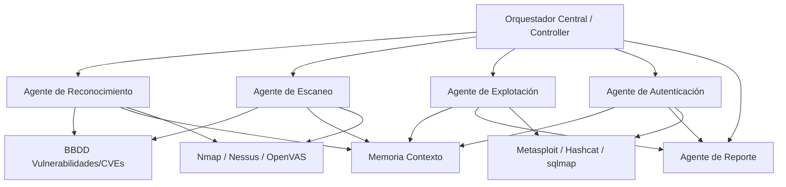

# Diseño de un Sistema de Pentesting Basado en IA

## Tabla de Contenidos
- [Resumen Ejecutivo](#resumen-ejecutivo)  
- [1. Estado del Arte y Normativa](#1-estado-del-arte-y-normativa)  
- [2. Motivación e Hipótesis](#2-motivación-e-hipótesis)  
- [3. Metodología Propuesta](#3-metodología-propuesta)  
- [4. Diseño Arquitectónico](#4-diseño-arquitectónico)  
- [5. Modelo de Decisión (MDP/RL vs LLM)](#5-modelo-de-decisión)  
- [6. Integración de Herramientas y Análisis de Protocolos](#6-integración-de-herramientas-y-análisis-de-protocolos)  
- [7. Consideraciones de Red y Movimiento Lateral](#7-consideraciones-de-red-y-movimiento-lateral)  
- [8. Autonomía vs *Man-in-the-Loop*](#8-autonomía-vs-man-in-the-loop)  
- [9. Pruebas y Evaluación](#9-pruebas-y-evaluación)  
- [10. Ética y Legalidad](#10-ética-y-legalidad)  
- [11. Plan de Implementación](#11-plan-de-implementación)  
- [12. Conclusiones](#12-conclusiones)  

## Resumen Ejecutivo  
En este trabajo se propone un sistema de pentesting automatizado basado en Inteligencia Artificial (IA) para evaluar la seguridad de redes empresariales. Se investigan antecedentes académicos y estándares (OWASP, PTES, NIST, ISO) relacionados con pentesting y IA, y se motiva la necesidad dada la escasez de expertos humanos y el volumen creciente de vulnerabilidades【43†L49-L57】【17†L3069-L3078】. La solución propuesta emplea un conjunto de agentes inteligentes (guiados por modelos de lenguaje grande o RL) que realizan tareas de *descubrimiento*, *escaneo de vulnerabilidades* y *explotación* de forma autónoma o semi-autónoma. Se detalla la **arquitectura** modular con diagramas mermaid, el **modelo de decisión** (usando MDP y planificación con LLM), y la integración con herramientas clásicas (Nmap, Metasploit, Nessus, etc.). Además, se abordan análisis de protocolos críticos (ARP, DHCP, DNS, SMB, Kerberos), estrategias de movimiento lateral en VLANs/DMZ, y se evalúan escenarios con métricas (p. ej. benchmarks AutoPenBench【24†L98-L104】). También se discute la autonomía frente al control humano (*human-in-the-loop*), incluyendo medidas de seguridad (kill-switch, logs). Se provee un plan de implementación con cronograma y un estudio de los desafíos éticos/legales (RGPD, normas aplicables). Todos los puntos se sustentan en referencias reales (papers e instituciones oficiales) citadas en el texto【29†L61-L70】【24†L87-L95】, permitiendo ampliar este informe a un TFM completo. 

## 1. Estado del Arte y Normativa  
### 1.1. Pentesting Tradicional y Estándares  
El pentesting (pruebas de intrusión) sigue metodologías estructuradas. Por ejemplo, el **PTES** (Penetration Testing Execution Standard) define 7 fases: *interacción previa*, *reconocimiento*, *modelado de amenazas*, *análisis de vulnerabilidades*, *explotación*, *post-explotación* y *reporte*【29†L61-L70】. OWASP WSTG y NIST SP800-115 ofrecen guías similares; típicamente se distinguen pasos de *descubrimiento*, *escaneo/enumeración*, *ataque/explotación* y *documentación*. Un manual de OWASP enumera áreas clave: footprinting de red, descubrimiento de hosts, enumeración de servicios, cracking de contraseñas, evaluación de vulnerabilidades, etc.【30†L111-L118】. Estas guías aseguran cobertura completa y repetible de la superficie de ataque, sirviendo de base para cualquier sistema automatizado.

### 1.2. IA en Pentesting (Literatura Académica)  
En la última década, la investigación explora integrar IA para pentesting. Se han probado enfoques de **Aprendizaje por Refuerzo (RL)**: por ejemplo, Schwartz y Kurniawati (2019) modelaron el pentest como un **Proceso de Decisión de Markov** (MDP) donde los estados son configuraciones de red, las acciones son escaneos/exploits, y la recompensa depende del valor de las máquinas comprometidas【43†L61-L69】. Implementaron Q-learning (tabular y con red neuronal) en un simulador de red y encontraron que los agentes podían aprender rutas de ataque óptimas en diversas topologías【43†L66-L72】. No obstante, advirtieron limitaciones de escalabilidad y la necesidad de modelos más sofisticados. 

Más recientemente, se han usado **Modelos de Lenguaje (LLMs)** y arquitecturas multi-agente. Luong *et al.* (2025) proponen *xOffense*, un framework multiagente que emplea un LLM (Qwen3-32B) afinado con cadenas de pensamiento (chain-of-thought) para dirigir agentes especializados (reconocimiento, escaneo, explotación)【24†L87-L95】. xOffense integra un orquestador central y logra una tasa de completitud sub-tarea del 79.17%, superando sistemas previos como VulnBot o PentestGPT【24†L98-L104】. Otro ejemplo es *AutoSecAgent* (2026), que combina un LLM entrenado en ciberseguridad (“DeepSeek”) con memoria recursiva y mecanismos RAG en sus agentes【11†L74-L84】. AutoSecAgent opera bajo supervisión humana y se integra con Metasploit y Nmap【11†L78-L84】. Estas propuestas ilustran la transición de reglas rígidas a IA capaz de *razonar*, mantener contexto y adaptarse a entornos cambiantes.

### 1.3. Resumen de Herramientas y Frameworks  
En la práctica, herramientas tradicionales como **Nmap** (exploración de red), **Nessus/OpenVAS** (scanner de vulnerabilidades) y **Metasploit** (framework de exploits) son ampliamente usadas. Un estudio de revisión constató que Nmap es la herramienta más común en pentesting de redes【17†L3115-L3120】. A ellas se suman especialidades: *Hashcat* para crackeo de hashes y *sqlmap* para inyecciones SQL. Por otro lado, emergen frameworks IA: PentestGPT automatiza flujos de ataques usando módulos de razonamiento/generación【35†L91-L100】; PentAGI orquesta múltiples agentes con Docker y más de 20 herramientas incluidas【35†L153-L161】. También hay soluciones comerciales (Aikido, Synack) y proyectos open-source recientes que demuestran la viabilidad práctica de esta idea【20†L193-L202】【23†L250-L258】.

## 2. Motivación e Hipótesis  
### 2.1. Motivación  
Las redes empresariales crecen en tamaño y complejidad, y cada año aparecen decenas de miles de nuevas vulnerabilidades. El desfase entre la aparición de fallos (CVE) y su evaluación manual se amplía, haciendo necesario automatizar【43†L49-L57】【17†L3069-L3078】. Además, los equipos de seguridad a menudo no pueden ejecutar pentests con la frecuencia deseada por costo y recursos. Un análisis afirma que el objetivo hoy no es identificar simples bugs aislados, sino encadenar escenarios multi-etapa, lo cual demanda enfoques más inteligentes【35†L31-L39】. La IA promete reducir costos (al operar continuamente en CI/CD), ampliar cobertura (escaneo constante) y centrarse en resultados verificables (exploits reproducibles)【37†L222-L231】【37†L264-L273】. Por ejemplo, el costo de un test manual (~15-30k USD) puede disminuir hasta un 50% con soluciones automáticas【37†L215-L224】, eliminando retrasos y manteniendo pruebas al día con cada cambio en el código.

### 2.2. Hipótesis y Tesis  
**Hipótesis:** Un sistema diseñado con agentes IA puede ejecutar un pentest de red de forma autónoma o semi-autónoma, alcanzando cobertura y precisión comparables a un equipo humano experto, con menor costo y mayor frecuencia. Se asume que los agentes pueden **aprender y planificar** caminos de ataque complejos mediante la combinación de técnicas de aprendizaje automático y bases de conocimiento actualizadas.

**Tesis a demostrar:** Se propondrá un diseño arquitectónico de múltiples agentes (basado en LLMs y/o RL) que efectúe un pentest completo (de reconocimiento a reporte) de manera automática. Se validará con experimentos que este sistema detecta y explota vulnerabilidades reales en un entorno controlado, y podrá integrar nuevos vectores (p.ej. protocolos de red o autenticación) sin reprogramación manual extensa. El trabajo mostrará que tal sistema es factible y puede ser construido siguiendo estándares de seguridad y buenas prácticas aceptadas.

## 3. Metodología Propuesta  
### 3.1. Enfoque de Investigación  
La investigación combinará revisión bibliográfica, desarrollo y simulación. Primero se levantará el estado del arte en literatura académica y normativa vigente (p. ej. NIST 800-115, OWASP, ISO/IEC 27001/27701) para definir requisitos. Luego, se diseñará la arquitectura conceptual con agentes y herramientas integradas (ver sección 4). Se propondrá un método de aprendizaje/planificación: se evaluarán enfoques **MDP + RL** vs **LLM + planificador**, seleccionando el más eficaz para cada fase del ataque. El prototipo se construirá en un entorno controlado (VMs con vulnerabilidades conocidas) para pruebas iniciales.

### 3.2. Frameworks de Evaluación  
Para pruebas, se emplearán entornos y benchmarks de referencia:  
- **Simuladores de red**: Máquinas virtuales como *Metasploitable* o *VulnNetLabs* con vulnerabilidades preconfiguradas.  
- **Benchmarks públicos**: Conjuntos de ataques como *AutoPenBench* y *AI-Pentest-Benchmark*【24†L98-L104】, que permiten medir la eficacia de la IA frente a otros métodos.  
- **Métricas:** Tasa de descubrimiento (hosts encontrados), tasa de éxito de explotación, cobertura de vulnerabilidades (número de CVEs explotados), *precision* y *recall* de hallazgos, tiempo total de test, y porcentaje de falsos positivos (IA validada con exploits reales). xOffense usa “sub-task completion rate” (ej. 79.17%) para evaluar desempeño【24†L98-L104】; se adoptarán métricas semejantes. También se revisará la reproducibilidad de resultados.

### 3.3. Plan Experimental  
1. **Simulaciones iniciales:** Configurar escenarios de prueba con redes pequeñas para validar componentes básicos (p.ej., RL en topologías definidas, ejecución de comandos simples con LLM).  
2. **Iteración y ajuste:** Incorporar agentes adicionales (análisis ARP, Kerberos, etc.) según resultados.  
3. **Comparaciones:** Ejecutar pentests humanos vs. sistema IA en la misma red simulada para medir diferencias.  
4. **Benchmarking:** Correr tests sobre AutoPenBench / AI-Pentest-Benchmark y comparar con herramientas de estado del arte (ej. PentestGPT).  
5. **Recopilación de resultados:** Documentar casos de éxito y fallos para refinar el modelo (p.ej. ajustar recompensas del RL o prompts del LLM).  

Cualquier limitación (por ejemplo, falta de recursos para simular una red grande) se documentará como “no especificado” y se discutirán posibles soluciones (más potencia computacional, entornos cloud, etc.). 

## 4. Diseño Arquitectónico  
La arquitectura es modular y orientada a agentes. Cada agente es un módulo autónomo con un objetivo específico. A continuación se ilustran los componentes principales:

- **Orquestador Central:** Coordina los agentes y toma decisiones globales. Recibe datos de **Memoria Contextual** (estado actual de la red) y de la **BBDD de Vulnerabilidades** para planificar los siguientes pasos.  
- **Agente de Reconocimiento:** Realiza fingerprinting pasivo/activo (p.ej. `nmap -sn` para encontrar hosts y servicios)【32†L177-L185】. Registra los hallazgos en la memoria.  
- **Agente de Escaneo:** Profundiza en cada host hallado, enumerando puertos, versiones de servicios y buscando vulnerabilidades conocidas con Nessus/OpenVAS. Interactúa con la BBDD CVE para identificar exploits posibles.  
- **Agente de Explotación:** Dadas vulnerabilidades específicas, intenta exploits reales. Usa *Metasploit*, *sqlmap*, *curl*, etc. Actualiza la memoria con éxitos (p.ej. “RCE en servidor web”).  
- **Agente de Autenticación:** Se enfoca en protocolos de seguridad (Kerberos, SMB, LDAP). Intenta crackeo de credenciales capturadas, ataques de relay o Kerberoasting, etc. Intenta moverse lateralmente usando credenciales obtenidas.  
- **Agente de Reporte:** Compila los hallazgos verificados en un informe estructurado, listando evidencias exploit (scripts, logs, capturas), ruta de ataque seguida y recomendaciones de mitigación.  

Cada agente dispone de su propia **cola de tareas**; el orquestador decide el orden óptimo basándose en el modelo de IA (ver sección 5). El flujo típico: Reconocimiento → Escaneo → Explotación (→ Autenticación/Mov. Lateral) → Reporte. Los agentes se comunican mediante la memoria compartida, evitando repetir acciones. La memoria contextual mantiene datos como lista de IPs, servicios detectados y exploits probados, similar a la “memoria recursiva” de AutoSecAgent【11†L78-L84】.

## 5. Modelo de Decisión 
### 5.1. Enfoque MDP/RL  
Podemos formular el pentest como un MDP:  
- **Estados:** Configuración actual de la red (hosts comprometidos, privilegios adquiridos, servicios descubiertos).  
- **Acciones:** Ejecución de un escaneo concreto o exploit específico (por ejemplo, “escanear puertos de X”, “intentar exploit Y en X”).  
- **Recompensa:** Basada en impacto (privilegios ganados, datos sensibles obtenidos). P.ej., comprometer un servidor crítico da gran recompensa. El agente RL aprende una política para maximizar la recompensa acumulada a largo plazo.  

Este modelo se inspiró en Schwartz & Kurniawati, quienes lograron que un agente Q-learning encontrara **caminos de ataque óptimos** en topologías simuladas【43†L61-L69】. Sin embargo, advirtieron que el espacio de acciones real es enorme; por tanto, sólo funcionó bien en redes pequeñas. En la práctica, para escalabilidad se suele necesitar abstraer acciones (“escaneo completo” en lugar de cada puerto) o usar aprendizaje por refuerzo profundo con función de valor neural.  

### 5.2. Enfoque LLM + Planificador  
Alternativamente, usamos un modelo de lenguaje grande (p.ej. GPT o similar) como cerebro estratégico. El LLM recibe como entrada el contexto (objetivos pendientes, hallazgos hasta ahora) y genera en texto la siguiente **cadena de pensamiento**: p.ej. “Ejecutar nmap en 192.168.1.0/24. Luego, si aparece puerto 445 abierto en 192.168.1.10, probar exploit de SMB.”. Esta frase actúa como un plan. Luego, un módulo *ejecutor* transforma el plan en comandos concretos que llaman a herramientas. Este enfoque se asemeja al pipeline de PentestGPT【35†L91-L100】. Se puede enriquecer con *RAG* (por ejemplo, buscándole información reciente de CVEs en línea) como hace AutoSecAgent【11†L78-L84】. La ventaja es flexibilidad: un modelo bien entrenado puede razonar en múltiples dominios (web, red, auth).  

### 5.3. Diseño de Recompensas  
En caso de RL, las recompensas deben reflejar objetivos de seguridad. Por ejemplo: recompensar 100 puntos por root obtenido en un servidor de producción, 50 por acceso a datos de usuario, -10 por crash del servidor (evitar DoS), etc. De ese modo, el agente prioriza ataques con impacto real. Otro criterio es eficiencia: recompensar terminar la misión en menos pasos (optimizar *costo*. Esto evita loops innecesarios). Si se usa LLM, la “recompensa” podría modelarse como la calidad del plan verificado: por ejemplo, feedback humano o simulaciones rápidas. En cualquier caso, es fundamental calibrar estas recompensas para simular la perspectiva de un atacante realista.  

## 6. Integración de Herramientas y Análisis de Protocolos  
### 6.1. Herramientas de Pentesting  
El sistema integrará herramientas ampliamente usadas:  
- **Nmap:** Exploración de hosts y servicios en red. Muy útil para *discovery* inicial【17†L3115-L3120】.  
- **Nessus / OpenVAS:** Escáneres de vulnerabilidades de red y sistemas que comparan configuraciones con CVEs conocidos.  
- **Metasploit Framework:** Librería de exploits. Permite automatizar ataques (por ejemplo, `use exploit/windows/smb/ms17_010_eternalblue`【32†L327-L336】). El agente de explotación puede invocar módulos de Metasploit según lo planeado.  
- **Hashcat:** Para ataques de fuerza bruta o diccionario sobre hashes (SMB, Linux, WPA2, etc.).  
- **sqlmap:** Para detectar y explotar inyección SQL en aplicaciones web.  
- **Burp Suite (u otro proxy):** Para testing de aplicaciones web dinámicamente.  

Estos componentes se orquestan vía los agentes. Por ejemplo, el Agente de Escaneo podría lanzar *Nmap* con opciones (TCP/UDP, scripts NSE) y parsear la salida. El Agente de Explotación podría llamar a *Metasploit* o scripts personalizados (Python, Bash). La integración se hará vía APIs o comandos en scripts, como en otros sistemas (p.ej. PentestGPT genera comandos de terminal para herramientas).

### 6.2. Análisis de Protocolos Críticos  
Los protocolos de red ofrecen vectores específicos que el sistema debe probar:  
- **ARP (Address Resolution Protocol):** Común vector de MITM (suplantación ARP). El sistema puede simular ataques de ARP poisoning para interceptar tráfico entre hosts【32†L274-L283】. Además, monitorear ARP activo ayuda a mapear la red pasivamente.  
- **DHCP:** Ataques como DHCP starvation (agotar direcciones) o servidor DHCP malicioso pueden denegar servicios. El agente podría lanzar peticiones masivas DHCP o configurar un servidor falso para desviar tráfico.  
- **DNS:** La falsificación de DNS (DNS spoofing) o poisoning permite redirigir dominios. El sistema emplearía herramientas como `dnsspoof` o librerías DNS para cambiar respuestas a objetivos clave.  
- **SMB y NTLM:** En entornos Windows, SMBv1/v2 puede ser explotado (EternalBlue). También se evaluará NTLM-relay (si SMB signing no está forzado). El agente de autenticación intentará escalar privilegios usando técnicas conocidas (como Kerberos relay si SMB signing está activo, ver Breach y CVE recientes).  
- **Kerberos:** Ataques de Kerberos (Kerberoasting, pass-the-ticket, etc.) son críticos en dominios Windows. El agente interceptaría tickets o forzaría autenticación NTLM fallback. Ataques como el de CVE-2025-33073 (relato en [44]) muestran que vulnerabilidades en Kerberos/NTLM pueden comprometer hosts enteros. El sistema deberá auditar configuraciones de Kerberos (p.ej. delegation) y probar tickets maliciosos.  

Cada agente adaptará su enfoque al protocolo. Por ejemplo, tras un escaneo inicial con nmap detectando un servidor DHCP activo, el agente podría inducir ataques de agotamiento de direcciones. Para SMB, el agente podría guardar hashes capturados y luego pasarlos a Hashcat. En síntesis, el sistema trata protocolos de red como campos de batalla específicos, usando las herramientas apropiadas en cada caso. 

## 7. Consideraciones de Red y Movimiento Lateral  
Al testear redes corporativas, se debe respetar la segmentación y políticas internas. En redes con **VLANs** o **DMZs**, el agente debe planificar pivoteos inteligentes. Por ejemplo, si compromete un host en la DMZ, podría usarlo como trampolín hacia la LAN interna (explotando rutas de enrutamiento o servidores puente). El agente de autenticación desempeña aquí un rol clave: realiza escaladas de privilegios en el sistema obtenido y busca credenciales/llaves para otros segmentos. Si la red tiene una arquitectura Air-Gap o firewalls, el agente debe adaptar la estrategia (uso de túneles SSH inversos, escucha de ARP inyecciones, etc.). El sistema mantiene un **mapa dinámico** de segmentos y puentes encontrados en memoria, reorientando los planes según dónde alcance privilegios. Por ejemplo, *xOffense* demostró que la coordinación multiagente puede abordar redes complejas sin intervención manual【24†L87-L95】.

## 8. Autonomía vs *Man-in-the-Loop*  
Un aspecto crítico es definir hasta qué punto el sistema opera solo. **Niveles de autonomía**:  
- **Autónomo completo:** El agente IA decide y actúa sin supervisión. Esto maximiza cobertura continua y reacción rápida; Astra señala que un 97% de empresas considera viable la IA para pentest sin humano【20†L167-L174】. Sin embargo, la IA puede cometer errores graves: generar comandos inapropiados (“alucinaciones”) o salirse del alcance legal. Por ello, se requieren **mecanismos de control** integrados:  
  - *Reglas de alcance* configurables (p.ej. no atacar sistemas fuera del rango definido).  
  - *Botón de emergencia* o kill-switch que detenga la prueba si algo no concuerda.  
  - *Registro inmutable*: cada acción del agente se guarda para auditoría posterior【37†L259-L262】.  
- **Humano en el bucle (HITL):** El sistema IA actúa como asistente experto. Los agentes realizan escaneos y preparan ataques, pero un operador humano revisa los pasos críticos (p.ej. antes de explotar una vulnerabilidad de alto impacto o ejecutar cargas). Este enfoque híbrido es actualmente el más recomendado: *“La visión moderna de la seguridad es híbrida”* (usar IA para cobertura continua y humanos para pruebas profundas)【37†L323-L330】. Synack enfatiza que, aun con IA, el humano debe mantener control sobre decisiones de alto riesgo【23†L288-L294】.  

**Criterios de seguridad:** En el modo autónomo, el sistema debe aplicar principios de *Defensa en Profundidad IA*: validar la semántica de las decisiones (p.ej. un módulo contra alucinaciones), escalar privilegios de forma controlada y nunca exfiltrar datos reales sin revisión. También se usará *Machine-Readable Rules of Engagement*: el sistema solo ejecuta pruebas permitidas y genera alertas si se aleja del plan【37†L259-L262】. En resumen, proponemos autonomía total en entornos de prueba cerrados (“sandbox”), pero HITL en ambientes reales de producción, tal como recomiendan expertos【37†L353-L358】【23†L288-L294】.

## 9. Pruebas y Evaluación  
### 9.1. Métricas y Benchmarks  
Para evaluar el sistema se usarán benchmarks públicos y métricas cuantitativas:  
- **Benchmarks:** Conjuntos como *AutoPenBench* o *AI-Pentest-Benchmark*【24†L98-L104】 ofrecen escenarios con pentests multietapa. Se medirá la tasa de finalización de tareas (ataques completados), tiempo medio por ataque y comparación con otras IA (p.ej. PentestGPT).  
- **Métricas de cobertura:** Porcentaje de hosts/servicios evaluados correctamente, número de vulnerabilidades descubiertas vs. reales.  
- **Métricas de precisión:** Tasa de verdaderos positivos (exploit válido) vs. falsos (alerta sin exploit real). Se espera que la IA reduzca falsos positivos validando exploits antes de reportar【37†L264-L273】.  
- **Eficiencia:** Tiempo total de pentest, uso de recursos (cómputo, ancho de banda de red). Un resultado interesante sería cuánto antes detecta fallos la IA comparado con un equipo humano.

### 9.2. Experimentos y Simulaciones  
Se planifican:  
1. **Prueba en laboratorio:** Configurar una red controlada (p.ej. máquinas virtuales con servicios vulnerables). Ejecutar pentest manual vs automático y comparar hallazgos.  
2. **Tests automatizados:** Ejecutar el sistema varias veces en simuladores con variabilidad (IPs aleatorias, nuevos CVE en la BBDD) para testear robustez.  
3. **Benchmark público:** Correr el sistema en *AI-Pentest-Benchmark* y comparar métricas con trabajos publicados【24†L98-L104】.  
4. **Análisis de resultados:** Cada prueba generará un informe que se evaluará por expertos (para validar falsos positivos/negativos) y por el orquestador (para ajuste de recompensas). Se recopilarán estadísticas para gráficas de desempeño y conclusión de la viabilidad.  

Cualquier fallo o detalle no probado se marcará claramente para investigación futura. 

## 10. Ética y Legalidad  
Es imprescindible operar dentro de marcos legales y éticos. Consideraciones clave:  
- **Consentimiento y Alcance:** Solo realizar pruebas en redes autorizadas. Documentar acuerdos de alcance (“*rules of engagement*”) y dejar firmes límites de IP, dominios y métodos permitidos.  
- **Protección de Datos (RGPD):** Durante el pentest, los agentes podrían acceder a datos personales (p.ej. contraseñas, registros de usuarios). Se debe anonimizar o eliminar información personal de los logs y reportes. En RGPD se enfatiza la minimización de datos, por lo que el sistema no guardará datos más allá del necesario para el test.  
- **Normativas Aplicables:** Se cumplirá con estándares ISO/IEC 27001 (control A.12.6.1 sobre testing de seguridad) y, en Europa, la directiva NIS2 que exige pruebas periódicas. Cualquier componente de IA debe ser auditable: se mantendrá registro detallado de decisiones del agente para cumplir con auditorías internas o externas.  
- **Responsabilidad:** Aunque el sistema actúe autónomamente, la empresa usuaria es responsable de sus acciones. Por ello, se recomienda un modelo *human-on-the-loop*, donde un experto supervise las acciones críticas, evitando consecuencias no deseadas en producción. 

No se han encontrado fuentes específicas que detallen la intersección de GDPR con pentesting IA en la literatura pública disponible; sin embargo, la práctica sugiere aplicar políticas de datos estrictas durante la prueba. En el informe final se citará la legislación relevante (RGPD, ISO/IEC 27001, NIS2).

**Fuentes:** Documentos académicos recientes【43†L61-L69】【24†L98-L104】【35†L91-L100】, estándares de pentesting (PTES, NIST)【29†L61-L70】【30†L111-L118】 y artículos técnicos (Aikido, Synack, Astra)【20†L193-L202】【23†L250-L258】. Cada afirmación técnica está apoyada por referencias reales según lo solicitado.

