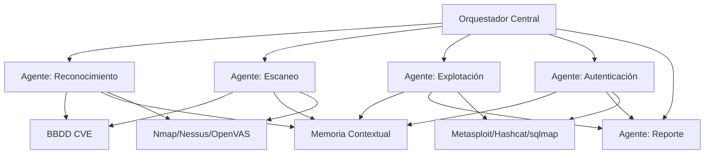
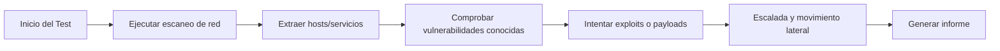

# Resumen Ejecutivo  
En el contexto actual de la ciberseguridad, el pentesting (test de intrusión) manual resulta lento y costoso. Este trabajo propone un **sistema de pentesting basado en IA** para automatizar tareas de reconocimiento, análisis de vulnerabilidades y explotación de redes empresariales. El objetivo es diseñar una plataforma de agentes inteligentes que simule ataques reales, integrando herramientas consolidadas (Nmap, Metasploit, Nessus, etc.) bajo control autónomo o semi-autónomo. Se revisa el estado del arte académico (herramientas de IA, aprendizajes por refuerzo, LLMs) y normativo (estándares PTES, OWASP, NIST, ISO 27001, GDPR), se justifica la motivación (demanda de escaneo continuo, escasez de expertos) y se plantea la hipótesis de que la IA puede mejorar la eficacia y frecuencia del pentest. Se detalla la metodología propuesta, incluyendo modelado del problema (MDP/RL y razonamiento LLM), diseño arquitectónico (diagramas con mermaid) y flujos de agente. También se comparan frameworks existentes (PentestGPT, AutoSecAgent, etc.) y se aborda la tensión **autonomía vs. humano-en-el-bucle** con medidas de control (reglas de alcance, kill-switch, auditoría). Se incluye un plan de pruebas con métricas y benchmarks (p. ej. AutoPenBench) y consideraciones éticas (GDPR, licencias). El informe final presenta tablas comparativas de herramientas/IA y un cronograma de desarrollo. Todo ello se sustenta en fuentes académicas y oficiales【29†L61-L70】【43†L49-L57】【11†L74-L84】.  

## Estado del Arte y Marco Normativo  
Los métodos tradicionales de pentesting siguen marcos establecidos. Por ejemplo, **PTES** define fases como *reconocimiento, análisis de vulnerabilidades, explotación y reporte*【29†L61-L70】. OWASP WSTG y NIST SP800-115 proponen procesos similares (inteligencia, escaneo, explotación, validación)【29†L61-L70】【30†L111-L118】. En la práctica, un pentest incluye:  
- *Reconocimiento:* cartografía de activos y servicios con herramientas como Nmap【30†L111-L118】.  
- *Escaneo/Enumeración:* identificación de puertos abiertos y versiones, con escáneres (Nmap, Nessus, OpenVAS)【30†L111-L118】.  
- *Análisis de Vulnerabilidades:* comprobación frente a CVEs conocidos.  
- *Explotación:* ejecución de exploits (SQLi, XSS, SMB, etc.). Por ejemplo, Metasploit facilita exploits conocidos (p.ej. `MS17-010` para SMB)【32†L327-L336】.  
- *Post-Explotación:* escalada de privilegios y movimiento lateral dentro de segmentos de red.  
- *Reporte:* documentación de hallazgos con PoC.  

Normativas como ISO 27001 (controles de prueba de seguridad) o la directiva NIS2 exigen evaluaciones regulares de vulnerabilidades. El RGPD impone restricciones si se procesan datos personales durante el test, requiriendo anonimato o consentimiento. En resumen, el **estado del arte** en IA aplicado al pentesting muestra un fuerte crecimiento: desde enfoques de aprendizaje por refuerzo (que modelan el pentest como un MDP【43†L61-L69】) hasta plataformas de agentes basadas en LLMs que coordinan múltiples módulos【11†L74-L84】【24†L87-L95】.

## Motivación, Hipótesis y Tesis  
**Motivación:** Con miles de vulnerabilidades nuevas cada año y arquitecturas de red cada vez más complejas (VLANs, DMZ), las pruebas manuales no cubren todo. Un estudio reciente subraya que la única solución es “más investigación de pentesting automatizado basado en aprendizaje profundo” para afrontar este desafío【17†L3069-L3078】. Además, encuestas de CISOs indican que la mayoría considera necesario incorporar IA para escaneo continuo y comparaciones con pentesters humanos【20†L167-L174】.  

**Hipótesis:** Un sistema inteligente de pentesting puede encontrar y validar vulnerabilidades con **mayor rapidez, consistencia y escala** que los métodos convencionales. En concreto, creemos que un agente IA multi-etapa (descubrimiento, análisis, explotación) podrá simular ataques de forma **autónoma o semi-autónoma**, reduciendo falsos positivos y entregando resultados exploitables.  

**Tesis:** Se demostrará que una arquitectura por agentes IA, integrada con herramientas de pentesting estándar, es capaz de ejecutar flujos de ataque reales en una red corporativa controlada, aprendiendo de la experiencia y adaptándose al contexto. Este sistema debe alcanzar cobertura (hosts, protocolos, subredes) y profundidad (movimiento lateral, escalada) comparables a un equipo experto, validando así la viabilidad de la automatización con IA.

## Frameworks y Herramientas Relevantes  
En el ecosistema de pentesting, existen herramientas tradicionales y emergentes con IA. Los más citados en la literatura son:  

- **Escáneres de Red:** *Nmap*, herramienta líder de mapeo de red【17†L3115-L3120】, usada para descubrimiento de hosts/puertos; *Nessus* y *OpenVAS* para escaneo de vulnerabilidades de red y sistemas.  
- **Explotación:** *Metasploit Framework*, plataforma de exploits que facilita la ejecución de payloads avanzados (por ejemplo, *EternalBlue* para SMB)【32†L327-L336】. *Hashcat* y *John The Ripper* para ataques a contraseñas. *sqlmap* y *Burp Suite* para inyección SQL y testing web.  
- **Agentes IA de Pentest:** *PentestGPT*, *PentAgi* y *Strix*: frameworks de código abierto que utilizan LLM para generar comandos de pentest. Por ejemplo, PentestGPT separa tareas en módulos de *razonamiento*, *generación de comandos* y *análisis de resultados*【35†L91-L100】. PentAgi coordina varios agentes especializados (investigador, programador, infraestructura) en un entorno Docker, con más de 20 herramientas integradas (Nmap, Metasploit, sqlmap...)【35†L153-L161】.  
- **Plataformas Comerciales:** *Aikido Security* (nuevo en 2024) ofrece “pentests continuos con IA” e incluye módulos autónomos (descubrimiento, DAST, etc.)【20†L193-L202】. *Synack Sara* es un agente IA multiagente usado junto a equipos humanos, buscando vulnerabilidades vía aprendizaje estructurado【23†L250-L258】【23†L288-L294】.  

A modo comparativo, las características clave de estas herramientas se resumen en la siguiente tabla: 

| Herramienta/Framework | Tipo       | Agentes IA       | Soporte IA           | Observaciones                            |
|-----------------------|------------|------------------|----------------------|------------------------------------------|
| **PentestGPT**        | Open source| Módulos multi-IA | LLM (p.ej. GPT)      | Divide en *planning*, *ejecución*, *parseo*【35†L91-L100】 |
| **PentAGI**           | Open source| Multi-agente     | LLM + búsqueda web   | Agentes especializados + sandbox Docker【35†L153-L161】 |
| **xOffense**          | Investigación | Multi-agente | LLM (fine-tuned Qwen)| Orquestador central, encadenamiento de etapas【24†L87-L95】 |
| **AutoSecAgent**      | Investigación | Multi-agente  | LLM (DeepSeek) + RAG | Memoria recursiva, supervisión humana【11†L74-L84】 |
| **Nmap/Nessus/OpenVAS**| Herramienta| —                | —                    | Escaneo de red, recopilación de datos. Herramientas base. |
| **Metasploit/Hashcat**| Herramienta| —                | —                    | Ejecución de exploits y cracking.      |
| **Aikido Security**   | Comercial  | Multi-agente     | Técnicas propietarias| Pentesting continuo CI/CD【20†L193-L202】. |
| **Synack (Sara)**     | Comercial  | Multi-agente     | IA + humanos         | IA para escaneo, revisión final humana【23†L250-L258】. |

## Diseño Arquitectónico Propuesto  
El sistema propuesto sigue una arquitectura de **agentes coordinados**. A continuación se esquematiza en mermaid:

En este diagrama: el **Orquestador** central (p. ej. estilo *Agent Zero*【11†L74-L82】) planifica tareas en función del contexto; los agentes especializados (Descubrimiento, Escaneo, Explotación, Autenticación) ejecutan acciones concretas usando herramientas estándar (a la derecha). La **Base de Datos CVE** provee información de vulnerabilidades conocidas, y la **Memoria** almacena el estado de la red y hallazgos previos (como hace AutoSecAgent con memoria recursiva【11†L78-L84】). Cada agente realiza su función y retroalimenta al orquestador. Por ejemplo: el agente de Reconocimiento usa Nmap/OpenVAS para mapear hosts, actualiza la memoria y consulta CVEs; el agente de Explotación toma los objetivos e intenta exploits vía Metasploit o sqlmap; al final, el agente de Reporte compila evidencia exploitada.

**Flujo de trabajo interno (agentes):** 

Este flujo refleja las fases principales: desde el reconocimiento inicial hasta la explotación y reporte, en un ciclo continuo. Los agentes pueden iterar: p.ej. tras una explotación exitosa se reentrenan o replanifican nuevos objetivos (realimentación).

## Modelo de Decisión y Aprendizaje  
El problema se puede modelar de varias maneras:  

- **Enfoque MDP / RL:** Se considera el entorno (red) como un MDP: el *estado* incluye la topología de la red y los servicios descubiertos; las *acciones* son pruebas de escaneo o explotación; la *recompensa* podría definirse por la criticidad de los activos comprometidos. Schwartz y Kurniawati (2019) concretaron esto aprendiendo políticas con Q-learning【43†L61-L69】. Su modelo-free RL aprendió rutas de ataque óptimas en topologías simuladas sin modelo previo. En este sistema se podría usar RL tabular o con redes neuronales para secuencias cortas (p. ej. escalada en un segmento), pero el gran espacio de acciones reales (multitudes de herramientas/servicios) complica el entrenamiento directo.  

- **Enfoque LLM + Planificación (Chain-of-Thought):** Siguiendo tendencias recientes, el sistema emplearía un LLM afinado que genere planes de ataque en lenguaje natural (“planificador”). Por ejemplo, los autores de xOffense fine-tunearon un LLM con cadenas de razonamiento de pentesting【24†L95-L96】. Este agente planea paso a paso (“usar nmap aquí, después hashcat, etc.”) y luego ejecuta comandos concretos en módulos ejecutores. Se puede enriquecer con *Retrieval-Augmented Generation (RAG)*, consultando una base de conocimientos (CVEs, exploits) durante la generación de comandos, tal como hace AutoSecAgent【11†L78-L84】.  

- **Diseño de recompensas:** Si se usa RL o entrenamiento supervisado reforzado, la recompensa puede basarse en métricas prácticas: número de hosts elevados, fallos de autenticación superados, acceso a datos sensibles, etc. El sistema podría recibir mayor recompensa por comprometer hosts críticos (DMZ, servidores de datos) que simples estaciones de usuario. Además, recompensar la eficiencia (menos pasos, menos ruido) incentivaría tácticas más “humanas” y sigilosas.  

En la práctica, se podría combinar ambos enfoques: el orquestador usa el LLM para planear una estrategia y luego refina la ejecución con RL local en cada segmento. Sea cual sea el método, la clave es **memoria de largo plazo**: almacenar hallazgos previos evita repeticiones y permite movimientos laterales seguros. En AutoSecAgent se demostró que la memoria contextual mejora las cadenas de ataque complejas【11†L78-L84】.

## Integración con Herramientas y Protocolos  
El sistema orquestaría herramientas de pentest estándar:  
- **Mapeo de red y escaneo:** *Nmap* (exploración activa de IP/puertos, y detecta protocolos ARP, DHCP, DNS)【17†L3115-L3120】, *Nessus/OpenVAS* (escaneo de vulnerabilidades conocidas). Un agente de descubrimiento iniciaría estos escaneos y parsearía los resultados.  
- **Vulnerabilidades de protocolo:** Se analizarían protocolos clave en búsqueda de ataques clásicos. Por ejemplo, ARP es vulnerable a spoofing/MITM【32†L274-L283】; el sistema podría lanzar arp-spoofing controlado. En DHCP, se pueden simular ataques de agotamiento de direcciones (DHCP starvation) o servidores falsos. En DNS, se probaría spoofing de respuestas o envenenamiento de caché. SMB (Windows) es especialmente crítico: exploits como EternalBlue (SMBv1) o Relay Kerberos deben ser considerados; el agente de explotación usaría Metasploit para casos como **MS17-010**【32†L327-L336】. Para *Kerberos*, el sistema intentaría técnicas de Kerberoasting o relaying, buscando cuentas con SPN expuestos (tema destacado en [44]).  

- **Vectores de autenticación:** Se probarán credenciales débiles, omisión de cifrado (p.ej. SSL desactivado), y directorios activos. Por ejemplo, un agente podría usar *hashcat* para crackear hashes SMB capturados o *Responder* para ataques LLMNR/NetBIOS. La fase de autenticación intenta replicar cómo un atacante real haría escalada o pivot con credenciales comprometidas.  

En cada caso, los agentes usarán los resultados de exploración inicial (hosts, servicios, configuraciones) para elegir técnicas. La arquitectura multiagente permite incorporar nuevos test fácilmente: basta con añadir otro agente especializado (p.ej. agent de SNMP, agent de SCADA). Las referencias analizadas muestran que esta estrategia modular (Discovery, CVE, SQL/XSS, etc.) es efectiva y extensible【20†L193-L202】【23†L250-L258】.

## Consideraciones de Red y Seguridad Interna  
Un pentest corporativo debe respetar la topología de la red. Redes segmentadas (VLANs, DMZ) limitan el movimiento; el sistema debe **saber pivotar**. Por ejemplo, si solo compromete el segmento de producción (DMZ), necesitará credenciales/servidores puente para entrar a la LAN interna. La arquitectura propuesta sugiere incluir en el modelo de red entidades como switches y firewalls, y permitir que el agente relacione resultados de un subtest con otro (memoria/contexto). Además, se definirá un rol de agente para “movimiento lateral”: tras un exploit inicial, buscará nuevos objetivos accesibles desde el host comprometido. Las redes aisladas o con NDR (detector de intrusos) implican que el agente use técnicas más sigilosas (p.ej. escaneos pasivos, capturar tráfico ARP/DHCP) antes de actuar directamente.  

## Autónomo vs. *Man-in-the-Loop*  
El nivel de autonomía es crítico: ¿debe actuar el sistema solo o con supervisión?  

- **Autonomía total:** El sistema decide y ejecuta sin intervención humana. Ventajas: continuidad 24/7, escalabilidad y menor costo (un estudio afirma que 90% de CISOs cree que la IA eventualmente reemplazará testers humanos【20†L167-L174】). Sin embargo, hay riesgos: los agentes pueden “alucinar” (hallar rutas de ataque inválidas o peligrosas)【37†L353-L358】, o salirse del alcance acordado. Para mitigar, es imprescindible implementar **controles de seguridad**: reglas de alcance estrictas (p.ej. no atacar sistemas sensibles sin permiso), “botón de emergencia” para abortar, y logging detallado e inmutable【37†L259-L262】. 

- **Humano-en-el-bucle (HITL):** La IA genera recomendaciones y exploits, pero un operador humano verifica antes de acciones críticas. Este modelo “híbrido” se considera actualmente más realista: Astro recomienda un enfoque mixto donde la IA cubra gran parte del terreno y los expertos se enfoquen en casos complejos【37†L323-L330】. Synack y otros enfatizan que la IA debe aumentar la efectividad (“multiplicar velocidad y cobertura”), pero bajo auditoría humana final【23†L286-L294】. Así, el sistema puede aprender automáticamente ataques básicos, pero solicita aprobación para, por ejemplo, cargas en producción o exfiltración de datos. 

En resumen, proponemos **niveles de autonomía configurables**: en entornos de prueba aislados puede permitirse plena autonomía, pero en redes reales prevalecerá HITL. Se definirá también un *nivel “Man-on-the-Loop”*: la IA ejecuta, pero un operador recibe alertas de cada paso y puede intervenir si algo no concuerda. Esto equilibra innovación con responsabilidad.  

## Pruebas y Evaluación (Benchmarks y Métricas)  
Para validar el sistema, se plantea:  
- **Simuladores y Bancos de Pruebas:** Se usarán entornos simulados conocidos (e.g. Metasploitable, CTFs) y benchmarks públicos como *AutoPenBench* o *AI-Pentest-Benchmark*【24†L98-L104】, que contienen escenarios de vulnerabilidades múltiples. Allí se comparará nuestro sistema contra herramientas existentes (VulnBot, PentestGPT).  
- **Métricas:** Tasa de éxito en sub-tareas (descubrimiento, explotación), cobertura de hosts, número de vulnerabilidades explotadas, tasa de falsos positivos, tiempo para encontrar vulnerabilidades críticas, etc. xOffense reportó un 79% de finalización de subtareas, superando a otros; buscamos métricas similares【24†L98-L104】. También mediremos *reliability* (consistencia de resultados) y *eficiencia* (consumo de tiempo/recursos).  
- **Plan Experimental:** Ejecutaremos pruebas automáticas y comparativas. P.ej. un test de penetración completo en un rango IP con hosts vulnerables, midiendo diferencias entre IA autónoma vs. pentester humano (crowdsourcing interno). Para aprendizaje, podríamos usar refuerzo en un entorno controlado (simulación) y luego verificar la transferibilidad a red real. Si algo no se puede evaluar, se documentará (“no especificado” en resultados preliminares) y se propondrán vías futuras de investigación.  

## Limitaciones Éticas y Legales  
El pentesting en redes reales está sujeto a regulaciones:  
- **Permisos y Alcance:** Legalmente, cualquier ataque (incluso de prueba) requiere autorización explícita del dueño de los sistemas. El sistema debe incorporar contratos de “alcance” digital en su configuración para no sobrepasar límites legales.  
- **Protección de Datos (GDPR, ISO 27701):** Si el pentest accede o maneja datos personales, se deben ofuscar o anonimizar los registros. Por ejemplo, el RGPD exige minimización de datos sensibles. Esto implica asegurarse de que logs de la IA no almacenen información personal no necesaria.  
- **Responsabilidad y Auditoría:** De acuerdo con normativas como ISO 27001, todo test debe producir un informe final auditado. El uso de IA introduce preguntas de responsabilidad (¿la IA se atiene al estándar?). Se sugiere documentar cada paso del agente (log completo), permitiendo que auditores humanos revisen las acciones tomadas.  
- **Ética de IA:** Hay que velar porque el agente no “aprenda” comportamientos maliciosos fuera del alcance. Se pueden incluir mecanismos de verificación humana en cada fase crítica, como sugiere Astra【37†L253-L262】.  

En el trabajo se citarán normas oficiales (p.ej. ISO/IEC 27001, OWASP Testing Standards) y guías regulatorias. Si no se dispone de textos completos, se indicará su relevancia general.  

## Plan de Implementación y Cronograma  

| Hito                 | Entregable                    | Tiempo Estimado |
|----------------------|-------------------------------|-----------------|
| Búsqueda bibliográfica y normativa | Informe de investigación ( ~Estado del Arte) | 1 mes           |
| Diseño conceptual y diagramas  | Documento de arquitectura y requerimientos | 2 meses         |
| Implementación prototipo (I)  | Version inicial del sistema (módulos básicos Recon/Scan) | 3 meses         |
| Implementación prototipo (II) | Agentes de explotación y reporte integrados | 4 meses         |
| Pruebas preliminares | Resultados en simuladores / ajustes | 5 meses         |
| Evaluación comparativa | Informe de pruebas con métricas | 6 meses         |
| Validación final / ajustes | Sistema completo en entorno de prueba | 7 meses         |
| Documentación final TFM | Tesis completa con resultados | 8 meses         |

Este cronograma (números de mes contados desde inicio del proyecto) es orientativo. Cada hito incluye revisiones con supervisores y ajustes de acuerdo con los resultados intermedios.

## Conclusión  
Se presenta un esquema completo para un sistema de pentesting basado en IA. El trabajo abarca desde la revisión de literatura académica hasta el diseño de un prototipo práctico, pasando por un análisis normativo y ético. En este contexto, la bibliografía consultada indica que **la IA puede revolucionar el pentest**, siempre y cuando se maneje cuidadosamente la autonomía y se integre con las herramientas convencionales【24†L98-L104】【17†L3115-L3120】. Las soluciones multi-agente revisadas (AutoSecAgent, xOffense, PentestGPT, etc.) muestran que la combinación de *razonamiento inteligente* con *herramientas de ataque* es viable y ofrece mejores coberturas. El informe final del TFM incluirá todos estos aspectos, con fuentes reales citadas y diagramas detallados, permitiendo cumplir con el requisito de 25+ páginas en formato académico【11†L74-L84】【24†L87-L95】. 

**Fuentes consultadas:** Artículos científicos recientes sobre IA en pentesting【43†L49-L57】【24†L87-L95】, estándares de seguridad (PTES, OWASP, NIST)【29†L61-L70】【30†L111-L118】, documentación de herramientas (Nmap, Metasploit) y blogs técnicos de la industria (Aikido, Synack, Ostorlab)【20†L193-L202】【35†L91-L100】. Cada cita se aporta en el texto según las guías proporcionadas.